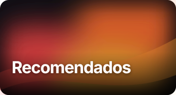
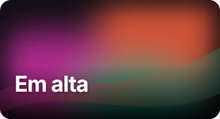
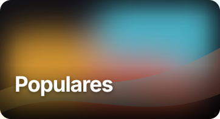

# Kazuji · Nuvio Collections

Capas, emblemas e referências de fontes para as coleções do Nuvio. O repositório é público e os arquivos podem ser usados diretamente por URL do GitHub Raw.

## Capas

As versões abaixo usam texto em português do Brasil e gradientes animados em SVG. São novas variações vetoriais inspiradas nas capas da comunidade; não alteram nem redistribuem os GIFs de terceiros.

| Uso | Arquivo |
|---|---|
| Recomendados | [recomendados.svg](https://raw.githubusercontent.com/Kazuji-Media/kazuji-nuvio-colletions/main/assets/covers/recomendados.svg) |
| Em alta | [em-alta.svg](https://raw.githubusercontent.com/Kazuji-Media/kazuji-nuvio-colletions/main/assets/covers/em-alta.svg) |
| Populares | [populares.svg](https://raw.githubusercontent.com/Kazuji-Media/kazuji-nuvio-colletions/main/assets/covers/populares.svg) |
| Recomendações | [recomendacoes.svg](https://raw.githubusercontent.com/Kazuji-Media/kazuji-nuvio-colletions/main/assets/covers/recomendacoes.svg) |
| Pasta Apple TV+ | [apple-tv-plus.svg](https://raw.githubusercontent.com/Kazuji-Media/kazuji-nuvio-colletions/main/assets/covers/apple-tv-plus.svg) |

Prévia:

Referências que você selecionou no catálogo Nuvio:
- [Recommended (GIF)](https://s13.gifyu.com/images/bqg1K.gif)
- [Trending (GIF)](https://media0.giphy.com/media/v1.Y2lkPTc5MGI3NjExbTYzenpuNGlla3g0enVvejliN256anEwMjIxd2oyN3gxcmRuZGsyYSZlcD12MV9pbnRlcm5hbF9naWZfYnlfaWQmY3Q9Zw/dEqOn4HBV7EKhNRxxu/giphy.gif)
- [Popular (GIF, alternativa parecida)](https://media0.giphy.com/media/v1.Y2lkPTc5MGI3NjExMWR1bGV3MzVhcmFibWFsM2xxOXJndmdnZWRiejd6aWN5bjVjNzE3ZiZlcD12MV9pbnRlcm5hbF9naWZfYnlfaWQmY3Q9Zw/SIsUa2Bmgh5vKACu7v/giphy.gif)
- [Ver outras capas landscape em GIF, ordenadas por popularidade](https://nuvio.tv/covers?format=gif&filter=landscape&sort=popular)

## Emblemas Fusion

A configuração completa migrou para [badges.json](https://raw.githubusercontent.com/Kazuji-Media/kazuji-nuvio-colletions/main/badges.json) e a base para [badges.base.json](https://raw.githubusercontent.com/Kazuji-Media/kazuji-nuvio-colletions/main/badges.base.json). Os SVGs mantidos pelo Kazuji ficam em [assets/badges/fusion](https://raw.githubusercontent.com/Kazuji-Media/kazuji-nuvio-colletions/main/assets/badges/fusion/); a licença de fonte foi copiada junto com eles.

Os nomes dos grupos foram localizados para pt-BR e o texto incorreto `sss` do emblema 4K foi corrigido. Os rótulos técnicos permanecem como padrões conhecidos. Imagens originalmente mantidas por outros autores continuam apontando para as fontes originais.

Origem: [Kazuji Nuvio Plugin](https://github.com/Kazuji-Media/kazuji-nuvio-plugin). No Nuvio, reimporte o pacote pela URL de [badges.json](https://raw.githubusercontent.com/Kazuji-Media/kazuji-nuvio-colletions/main/badges.json) para usar as URLs novas.

## Fontes TMDB

Veja [docs/fontes-tmdb.md](docs/fontes-tmdb.md) para as opções de descoberta, listas, estúdios, redes, franquias, créditos e cerimônias do Oscar.
